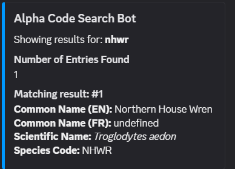

# Birding Discord Bot

The Birding discord bot or Alpha-code-search-bot was originally created to make reporting bird sightings in North America faster, easier and more accessible for everyone. With a simple command, you can look up either a 4-letter AOS code, common name or scientific name of a bird species and the bot will return the naming convention information of the bird you were looking for!

```\code nhwr``` 

would return this result: 



Based on the Aug 2024 AOS 65th taxonomy supplement: 
https://www.birdpop.org/pages/birdSpeciesCodes.php


## Installation


To install the bot to your server, you will first need administator privilages. Then follow the links below: 

https://discord.com/oauth2/authorize?client_id=786342936496570410


This will take you through Discord's Add App workflow

You may need to adjust the permissions in discord after adding the bot to better reflect the scope you need the bot for. 


## Additional Commands

TBC

### Support
🐦 If you have enjoyed using the Birding Discord Bot, consider donating to help cover hosting fees!
  https://www.buymeacoffee.com/alphacodesearchbot 


